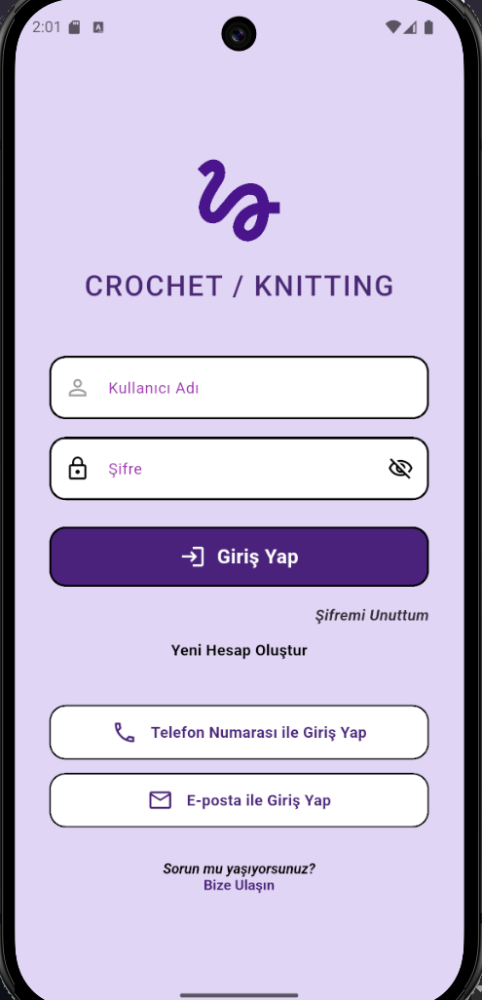
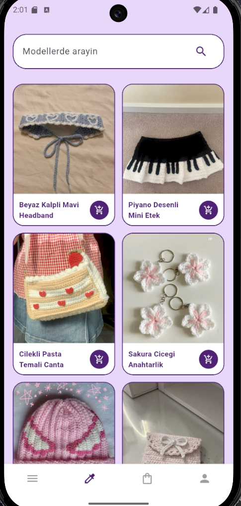
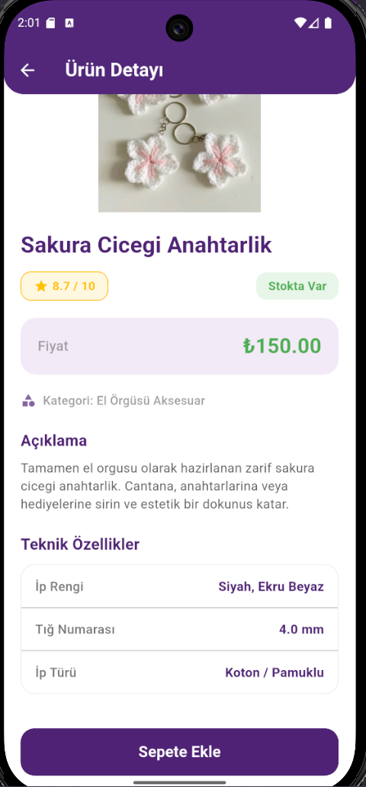
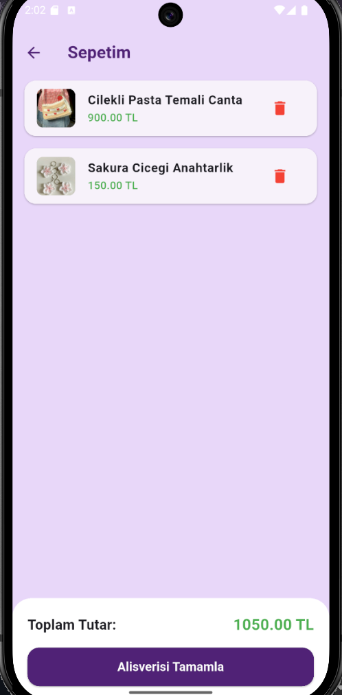

# Crochet Knitting Store

Bu proje, el emeği örgü modellerini (saç bandı, mini etek ve çanta gibi) sergilemek için hazırladığım şık ve modern arayüze sahip bir mobil katalog / e-ticaret uygulamasıdır. Kullanıcılar ana sayfada ürünleri yan yana ikili ızgara (Grid) yapısında görebilir, ürünlerin üzerine tıklayarak detay sayfasından kullanılan tığ numarası, ip rengi gibi örgüye özel teknik özellikleri inceleyebilir.

## Kullanılan Teknolojiler & Flutter Sürümü
*   **Framework:** Flutter (3.x ve üzeri güncel SDK sürümleri)
*   **Programlama Dili:** Dart
*   **Özellikler:** 
    *   Görsellerin internet üzerinden dinamik olarak çekilmesi (`Image.network`)
    *   Responsive GridView düzeni
    *   Uygulama genelinde uyumlu özel renk paleti (`Color(0xFF502176)` mürdüm tonu)

## Uygulama Ekran Görüntüleri

| Ana Sayfa | Ürün Detay Sayfası |
|---|---|
|  |  |
|   |  |
